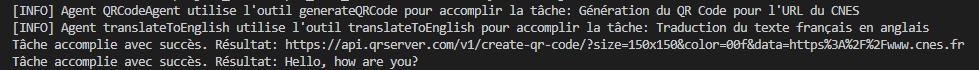
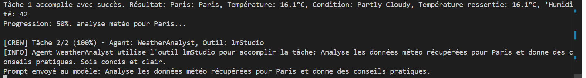
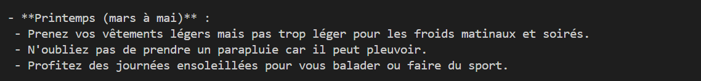
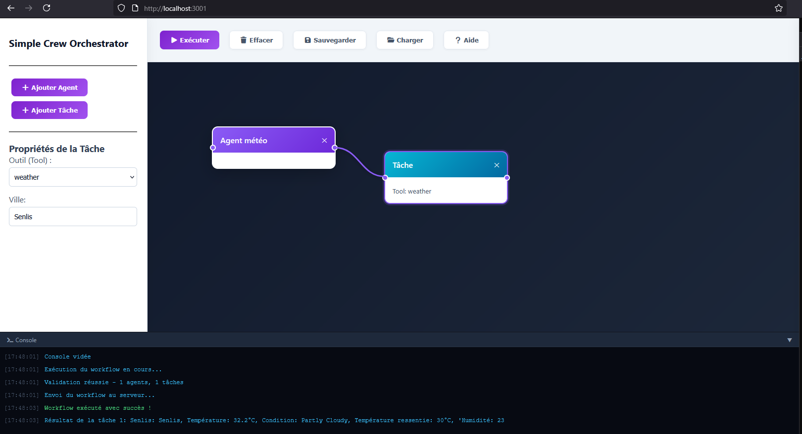

# Simple Crew Orchestrator

Ce projet est un framework léger codé en Node.js en vue d'orchestrer des agents IA autonomes capables d'utiliser des outils réels comme des APIs ou la gestion de système de fichiers et d'automatiser des tâches.


## 1. Introduction 

### 1.1. différence entre une IA classique et un Agent:

- **L'IA classique** génère du texte seulement
- **L'Agent IA** utilise des outils pour exécuter du code comme envoyer un email, chercher sur le web ou générer un fichier


### 1.2. Inspirations du projet

Ce projet s'inspire de concepts comme CrewAI (Python) ou n8n mais implémenté de manière minimaliste en JavaScript

- **Approche équipe de CrewAI**: faire collaborer plusieurs agents en ligne de commande (CLI)
- **Approche flux de n8n** : automatiser des actions logiques avec une interface graphique

---

## 2. Objectif du projet

Créer une équipe d'agents capables de travailler à la chaîne, par exemple : 
1. **Agent source**  qui récupère des données météo via API
2. **Agent rédacteur** qui transforme les données brutes en bulletin météo ou article de blog
3. **Agent archiveur** : qui sauvegarde le résultat final dans un fichier local.

Ce projet propose d'abord une version Console (CLI) puis une version Interface Graphique (GUI) via Express.

---

## 3. Configuration Technique

### 3.1. Pré-requis 

- Node.js (v18+) et npm 
- VS Code
- LM Studio en local 

- Applications en ligne similaires à LM Studio: [Ollama](https://ollama.com/) ou [Groq](https://console.groq.com/home)
-> créer un compte gratuit et récupérer les clés d'API, port différent

### 3.2. Installer les dépendances npm (dans package.json) 

```
npm i dotenv
npm i express (ordi devient comme serveur web)
npm i node-fetch (récup data de l'API)
```

### 3.3. Récupérer le projet 

- Cloner le projet 
- Exécuter `npm install`
- Créer un fichier `.env` à la racine du projet

---

## 4. Configuration de l'IA (LM Studio)

### 4.1. Télécharger un modèle (ex: Llama 3.1 8B Instruct ou Llama 3.2 3B)

- se mettre en "mode developer"
- search (loupe) le modele (chiffre suivi de B: nb de milliards de param que model dispose -> on reste jusqu'à 8b max)
-> 1. model: Llama 3.1.8B instruct (entrainé pour suivre instructions) -> fusée verte à droite si le model est compatible 
 recommandé K4.S mais mieux Q4.M -> download
-> 2. sinon : Llama 3.2.3B instruct 
-> 3. sinon : Llama-3.2-1B-Instruct-GGUF
- Ejecter le modele pur ne pas consommer trop puissance de l'ordi, aller dans API (à gauche menu Developer) 

### 4.2. Dans l'onglet AI Server :

Avce le switch: 
- activer le serveur "status running"
- activer l'option CORS dans "settings"
- charger le model Llama 3 8B instruct au milieu 

### 4.3. Copier les infos dans le .env

- Copier à droite : route de l'API et nom modele dans .env: paste : 
```
LM_API_URL=http://127.0.0.1:1234/v1/chat/completions
LM_MODEL=meta-llama-3.1-8b-instruct
```
En dessous: routes qui nous interesse: `POST/v1/chat/completions`
LM studio doit tourner avec l'API en arriere plan 

---

## 5. Architecture du projet 

### 5.1. Le cœur du système repose sur 3 classes dans `core.js`: 

- **Tool**: outil pour définir une action concrète comme faire un appel API ou écrire dnas un fichier
- **Agent**: agent AI qui réfléchit et décide quel outil utiliser
- **Task**: tâche précise confiée à l'agent IA

### 5.2. Organisation des fichiers:

- **core.js**: classes de base (moteur)
- **tools.js**: les outils disponibles
- **MyCrewDemo.js**: le chef d'orchestre qui crée les agents et lance les tâches

---

## 6. Exemples d'outils 

### 6.1. Générer un QRCode coloré avec l'adresse URL d'un site 

- Créer un agent capable de générer un QR code bleu pour le site du CNES

*   **API utilisée pour générer QR code** : [QR Server API](https://goqr.me/api/)
*   **Paramètre spécifique** : `&color=0-0-255` (Bleu)


### 6.2. Traducteur français - anglais 

- Créer un agent capable de lire un fichier en français puis de le traduire en anglais et enfin l'enregistrer dans un fichier

*   **API utilisée pour traduction** : [MyMemory](https://mymemory.translated.net/doc/spec.php) 
*   **TRANSLATE_API_KEY** : pour échange sécurisé avec l'API `TRANSLATE_API_KEY=user@yourdomain.com`

MyMemory fonctionne sur un système d'identification par email pour augmenter ton quota gratuit (environ 10 000 mots par jour).
Nul besoin de copier une clé API, ajouter son email dans l'URL de la requête avec le paramètre `de=`

-> Exécuter `node MyCrewDemo.js`, `node examples/weatherCrew.js`




---

## 7. Cas Pratiques : Orchestration Multi-Agents (Crews)

### 7.1. Application météo multi-agents

Ce cas d'usage démontre la capacité d'orchestration entre un agent spécialisé 
en outils (Tools) et un agent spécialisé en analyse (LLM)

**Fonctionnement de l'équipe**

1. WeatherFetcher (Agent 1) : interroge l'API météo et extrait les données comme température, humidité, conditions

2. WeatherAnalyst (Agent 2) : récupère le résultat du premier agent pour rédiger une analyse contextuelle et des conseils pratiques via LM Studio

**Configuration requise**

- source de données : [WeatherAPI](https://www.weatherapi.com/)
- variables d'environnement (.env) `WEATHER_API_KEY=****** : Clé secrète pour l'accès aux données météo` (Créer un compte gratuit)

#### L'Outil : weatherTool

L'outil est défini comme une instance de la classe Tool. 
Il agit comme une interface entre le code et l'API externe.

- Fonction : effectue une requête HTTP fetch vers WeatherAPI
- Formatage : ne renvoie pas tout le JSON brut (trop lourd pour l'IA), mais une chaîne de caractères optimisée (nom, température, conditions, humidité)
- Sécurité : utilise WEATHER_API_KEY stockée dans le .env

#### L'Équipage : weatherCrew

Le fichier example/weatherCrew.js définit la logique de collaboration :

- WeatherFetcher : agent équipé du weatherTool. Sa mission est de transformer une ville (input) en données techniques

- WeatherAnalyst : agent utilisant LM Studio. Il ne possède pas d'outil mais reçoit les données du premier agent pour rédiger des conseils

#### Flux de données (Data Pipeline)

L'orchestration est gérée par la classe Crew qui assure le transfert du lastResult :
`Outil Météo ➔ Données Brutes ➔ Input Agent IA ➔ Conseils Finalisés`

=> **Lancement** à la racine `node example/weatherCrew.js`




---

### 7.2. Recherche web et écriture dans un fichier (`MyCrewdemo.js`)

Equipe de 5 agents collabore pour automatiser une veille économique complète: 
du scraping internet jusqu'à la création d'un fichier markdown. 

#### Fonctionnement de l'équipe 

1. **Fetcher** (outil: `fetch`) scrape contenu brut de la page web à partir d'un mot-clé,
2. **Analyst** (outil: `lmStudio`) analyse ce contenu brut pour en faire un résumé,
3. **Extractor** (outil: `lmStudio`) extrait uniquement les faits et chiffres clés de ce résumé, 
4. **Writer** (outil: `lmStudio`) rédige un article de blog optimisé SEO en Markdown, 
5. **Injector** (outil: `fileWrite`) enregistre le texte final dans un fichier local `result.md`.

#### Pipeline de données 

`Web Scraping ➔ Résumé ➔ Faits Clés ➔ Article Markdown ➔ Fichier result.md`

#### Pour exécuter ce cas d'usage run `node ./MyCrewdemo.js`

#### Limite du test : Ce n'est pas le résultat attendu 

Bien que la chaîne technique fonctionne parfaitement sans aucun crash: le fichier `result.md` se génère bien,
**le contenu de l'article n'est pas celui recherché au départ**. 
Au lieu d'avoir un article chaud avec les derniers chiffres économiques de 2026,
l'IA a généré un texte de conseils généraux sur l'économie.

**Pourquoi ce décalage ?**

La Fondation Wikimédia a officiellement **fermé les projets Wikinews le 4 mai 2026**.
L'URL ciblée (`https://fr.wikinews.org/...`) est donc figée en lecture seule 
et ne contient plus aucune actualité récente. 

Face à cette page "vide" de news fraîches, le modèle LM Studio a improvisé en 
écrivant un article méthodologique sur "comment suivre l'économie". C'est une 
belle preuve d'adaptation de l'IA, mais cela montre qu'il faut changer de 
source de données (URL) pour obtenir un vrai article d'actualité. 

---

## 8. Interface graphique 

Lancer le server: `node webServer.js` => accessible sur `http://localhost:3001/`




